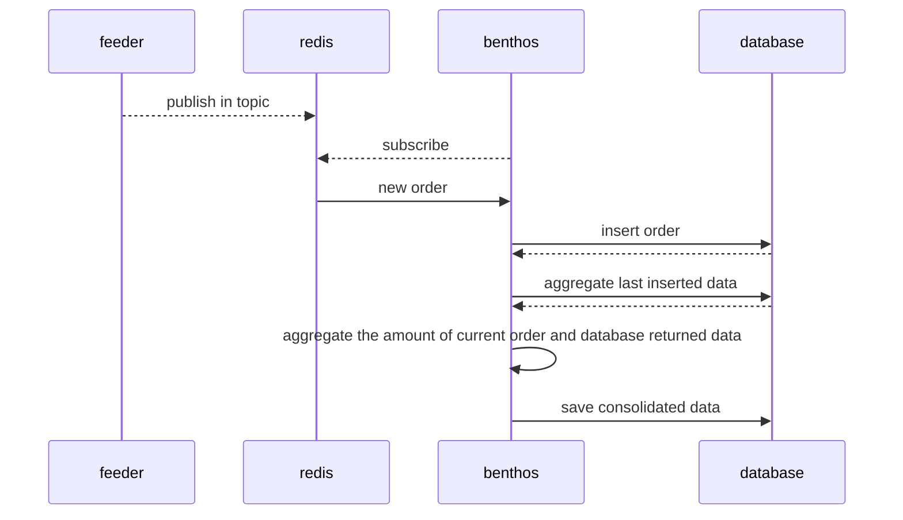

# Benthos POC

> :warning: This repository is a POC and can't be used in production

This repository contains some Proof of Concept created with Benthos to made data ingestion and save aggregation of this data using CDC technique.

## Running

Once you hace docker and docker-compose installed, just run `docker-compose up`.

## Details

This repository contains 4 containers, being it:

- `feeder` is the container that produces artificial orders that is processed on this pipeline;
- `redis` is used only as a publish/subscriber broker;
- `ingestor` which is a container of [benthos](https://benthos.dev) that make the ingestion of artificial produced data;
- `database` is a PostgreSQL database where the data processed is stored

Below you can see the flow of this PoC:

